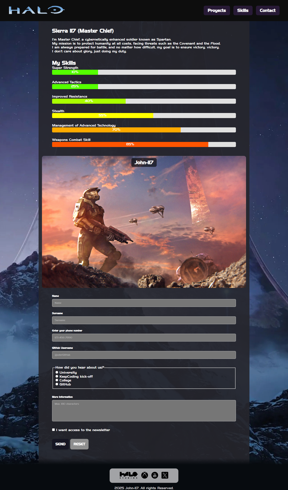
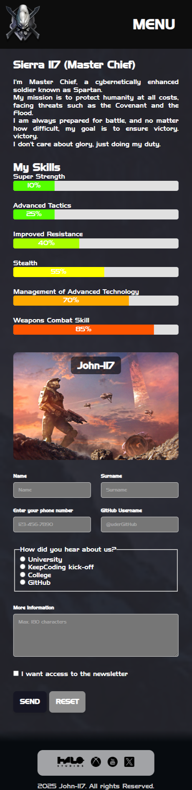
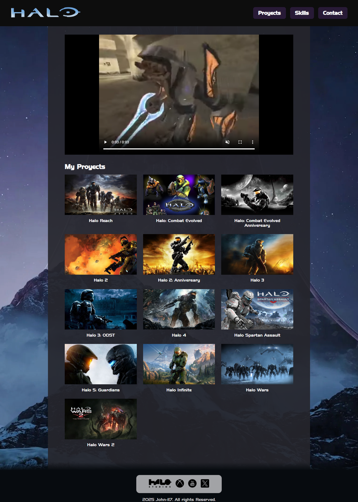
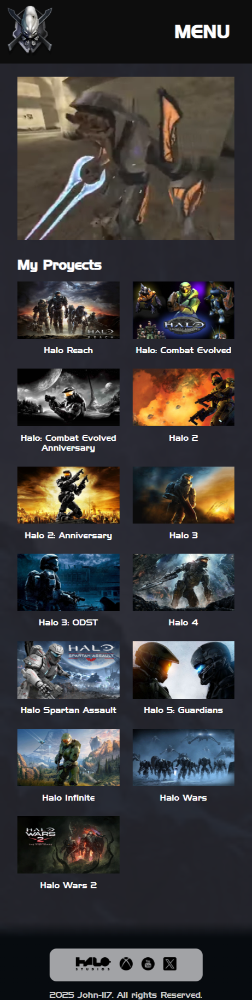
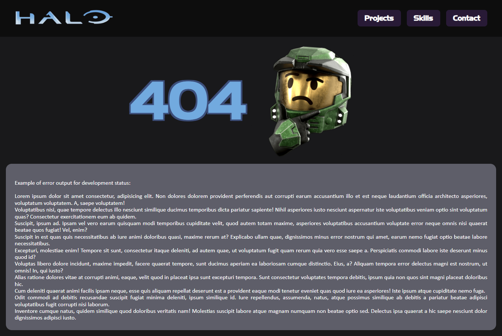
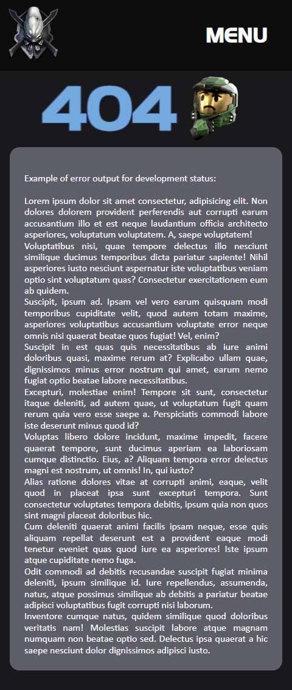

## Wählen Sie Ihre Sprache.

- 🇺🇸 [Englisch](README.md)
- 🇪🇸 [Spanisch](README.es.md)

## Projekt-URL
[https://pablosch26.github.io/keepcoding-html-css-submission-2](https://pablosch26.github.io/keepcoding-html-css-submission-2)

# CSS- und HTML-Projektabgabe

Dieses Projekt wurde mit dem Ziel erstellt, das in den virtuellen Klassen über HTML und CSS erworbene Wissen zu üben und zu demonstrieren.

## Das Projekt umfasst die folgenden Schlüsselaspekte:

- Implementierung von strukturiertem **HTML** und dessen Interaktion mit dem **DOM**, begleitet von kaskadierenden Stilen mit **CSS**.
- Richtige Verwendung der **Semantik** der HTML-Tags, kombiniert mit CSS-Regeln, die die Zugänglichkeit und Leistung verbessern.
- Entwicklung von **Media Queries**, um ein **responsives** Design zu gewährleisten, das sich an verschiedene Bildschirmauflösungen anpasst.
- Erstellung dynamischer **Animationen** und **Übergänge** mit **CSS**, um das Benutzererlebnis zu verbessern.
- Anpassung von Animationen durch die Verwendung von **Keyframes**, um einzigartige visuelle Effekte zu erzielen.
- Gestaltung eines **responsiven Layouts** mithilfe von **CSS-Grids** für eine flexible und skalierbare Struktur.
- Anwendung einer korrekten **CSS-Hierarchie**, um eine korrekte Formatierung und visuelle Konsistenz der Elemente zu gewährleisten.
- Analyse des Verhaltens der verschiedenen **HTML-Tags** und deren Interaktion mit **CSS**, um die Präsentation des Inhalts zu optimieren.
- Implementierung von **Eingabefeldern** mit effektiven **Validierungen**, um die korrekte Benutzerinteraktion mit Formularen zu gewährleisten.
- Einbindung von **Links** zur Navigation zu anderen Websites, um die Konnektivität und Zugänglichkeit zu verbessern.
- Gewährleistung der **Kohärenz und Sauberkeit des Codes**, mit einer organisierten Struktur, die die Wartung und Skalierbarkeit des Projekts erleichtert.

## Projektziel

Das Hauptziel dieses Projekts ist die Entwicklung eines persönlichen **Portfolios** (oder eines für eine fiktive Figur), unter Anwendung des in der Klasse erlernten Wissens. Die Idee ist, eine interaktive und visuell ansprechende Präsentation zu erstellen, die die Fähigkeiten und Projekte unserer gewählten Figur zeigt, unter Verwendung der Technologien und Praktiken, die während des Kurses erlernt wurden.

## Projektdetails

- Ein **Header** muss erstellt werden, in dem die Links einen sanften `hover`-Übergangseffekt haben sollen. Diese Links sind in der mobilen Version nicht notwendig.
- Ein Abschnitt mit einer **Über uns**-Beschreibung und unseren Fähigkeiten, dargestellt durch **Fortschrittsbalken**. Diese Balken müssen mit **CSS** animiert werden.
- Ein **Banner**, das ein Hintergrundbild haben muss. Auf mobilen Bildschirmen sollte ein anderes Bild angezeigt werden (Implementierung von **Media Queries** oder **Responsive Images**).
- Ein Kontaktformular mit **Eingabefeldern**. Alle Felder müssen die richtigen Typen und die korrekte HTML-Validierung verwenden:
  - **Vorname**, **Nachname**, **Telefonnummer** (Pflichtfelder).
  - **Radio-Button** zur Beantwortung der Frage "Wie hast du mich kennengelernt?" (Pflichtfeld):
    - Universität
    - Keepcoding Kick-off
    - Schule
    - Auf GitHub
  - **GitHub-Tag** (Verwenden Sie den regulären Ausdruck `^@[^\s]+` zur Validierung - `@Benutzername`).
  - **Textarea** mit weiteren Informationen des Nutzers (maximal 180 Zeichen) (Pflichtfeld).
  - **Checkbox** für die Anmeldung zum **Newsletter**.
  - **Speichern**- und **Zurücksetzen**-Schaltflächen.
- **Footer** mit Links zu unseren sozialen Medien unter Verwendung externer Ressourcen.
- Eine neue Seite, die ein **Video** enthält, das beim Betreten der Website automatisch abgespielt wird und mit einer **FadeIn**-Animation erscheint.
- Erstellen Sie eine neue Seite mit einem **Grid**, das unsere Projekte anzeigt.

### Optional
- Erstellen Sie ein Burger-Menü nur mit CSS und einem Eingabe-Kontrollkästchen, um JS zu vermeiden.
- Auf Github-Seiten bereitstellen.
- 404-Seite. Freies Design.
- Seite 500. freies Design.

## Technologien

Dieses Projekt wurde ausschließlich mit den folgenden Technologien entwickelt:

- **HTML**: Zur Strukturierung des Inhalts und der Erstellung des Seitenlayouts.
- **CSS**: Für das Design und Styling der Seite, um ein attraktives und konsistentes Benutzererlebnis zu gewährleisten.

## Installations- und Nutzungshinweise

### Softwareanforderungen

- **Git** (Erforderlich)
- **SourceTree** (Optional)
- **Visual Studio** (Version 1.99.0 verwendet) (Erforderlich)
- **Live Server** (Visual Studio Addon, Optional)

### Programmbeschreibungen

- **Git**: Versionskontrollwerkzeug. Essenziell, um das Repository zu klonen.
- **SourceTree**: Ein visuelles Tool zum Verwalten von Git-Repositories. Ermöglicht die einfache Interaktion mit Git, ohne die Befehlszeile zu verwenden.
- **Visual Studio**: Integrierte Entwicklungsumgebung (IDE), die notwendig ist, um das Projekt auszuführen. Stellen Sie sicher, dass Sie Version 1.99.0 verwenden, um Kompatibilitätsprobleme zu vermeiden.
- **Live Server**: Visual Studio-Erweiterung, die es ermöglicht, HTML-Dateien lokal in einem Browser anzuzeigen und Änderungen in Echtzeit zu sehen.

### Schritte zur Nutzung dieses Projekts

1. Klonen Sie das GitHub-Repository mit **SourceTree** oder direkt mit folgendem Git-Befehl:

   ```bash
   git clone https://github.com/PabloSch26/keepcoding-html-css-submission-2.git
   
2. Sobald das Repository geklont wurde:

2.1 Öffnen Sie das Projekt in Visual Studio, indem Sie den Projektordner zu Ihrem Arbeitsbereich hinzufügen.

2.2 Öffnen Sie die Dateien index.html, proyect.html, 404.html und 500.html mit Live Server, um sie im Browser vorzuschauen.

### Hinweise

-Stellen Sie sicher, dass alle erforderlichen Programme korrekt installiert sind, bevor Sie mit dem Projekt fortfahren.
-Wenn Sie SourceTree nicht verwenden möchten, können Sie das Repository direkt über das Terminal mit dem git clone-Befehl klonen.

## Keine Beiträge oder Lizenzen

Dieses Projekt hat derzeit keine externen Beiträge oder eine Lizenz.

## Projektvorschau

### Index View

### Index Mobile View

### Projects View

### Projects Mobile View

### 404 View

### 404 Mobile View

